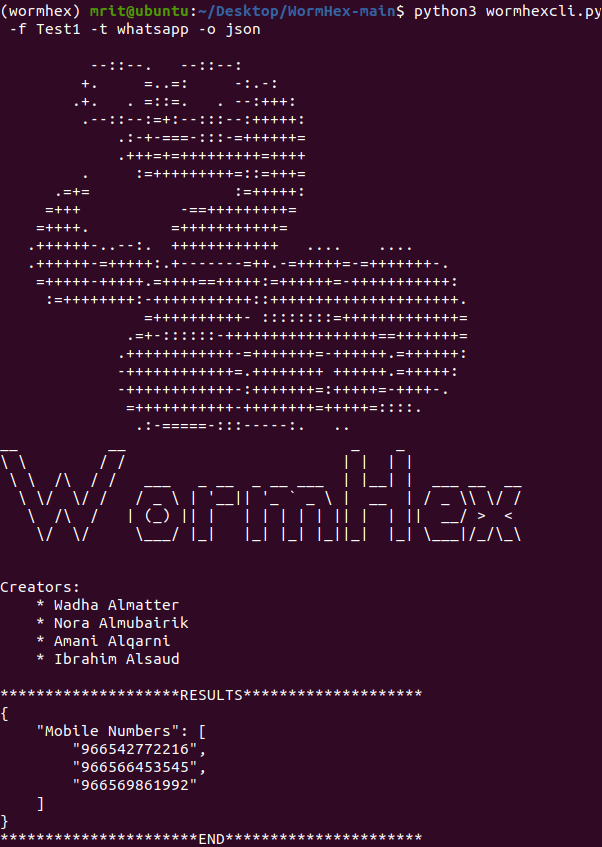

# WormHex

WormHex is a commandline tool for the Retrieval of Social Media Evidence from Volatile Memory.

## Dependencies
* python3 and pip/3
* on Windows, MacOS, Ubuntu, and Kali
  * `pip install -r requirements.txt`
  
## Running
* `python3 wormhexcli.py -h`
* shows a help promp with avalible optiosn. 
* To test the tool, you can use:
* `python3 wormhexcli.py -f memory_dumps/Test1 -t whatsapp -o json`
* `python3 wormhexcli.py -f memory_dumps/Test2 -t twitter -o json` 

## References
You can read the [full paper on WormHex.](https://publications.waset.org/10012579/wormhex-a-volatile-memory-analysis-tool-for-retrieval-of-social-media-evidence)
